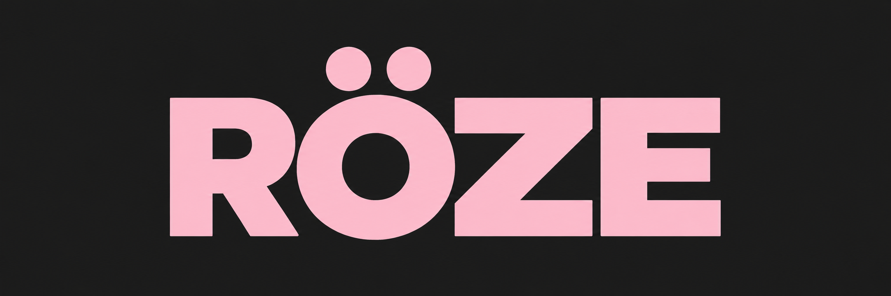

<p align="center"></p>

röze is a sampler VST built with JUCE (VST3 & Standalone).
röze supports its own sampling engine, built from scratch (`engine/`)
röze supports 47 audio formats out of the box, with automatic format detection
röze supports loading, mapping and playing your sounds straight from your DAW

```bash
cmake -B build && cmake --build build
```
